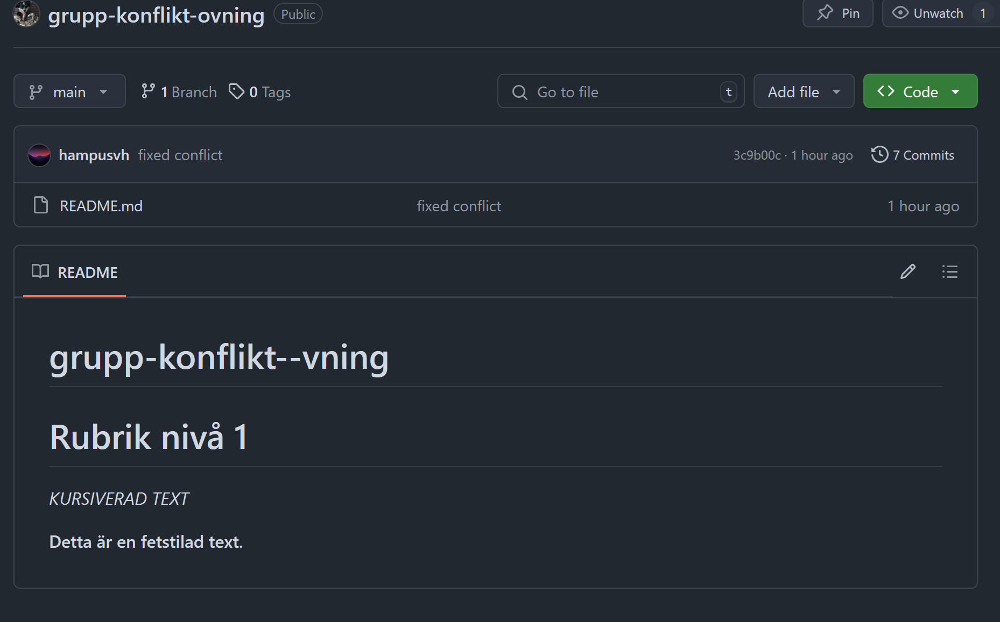

# grupp-konflikt--vning
> Målet med den här övningen är att vi ska lära oss att skriva i vim och lösa konflikter.
# Rubrik nivå 1

<h3 id="hello-world">Rubrik med ID</h3>

[Den här går till headern](#hello-world)

``
const addSum = (a, b) => {
    return a + b
}
``

I need to highlight these <mark>very important words</mark>.
I need to highlight these <mark>very important words</mark>.
I need to highlight these <mark>very important words</mark.


X<sup>2</sup>

Gone camping! :tent: Be back soon.
That is so funny! :joy:

[GOOGLE](https://www.google.se/)

*KURSIVERAD TEXT*

**Detta är en fetstilad text.**
# Funktioner
<ul>-`h`- Flytta vänster</ul>
<ul>- `j` - Flytta ner</ul>
<ul>-`k`- Flytta upp</ul>

Här är lite [^1] text.
[^1]: Teknisk term

# Uppgiftslista
-[] Gör uppgift 1
-[] Gör uppgift 2

{
    "name": "Pelle"
}



1. steg 1
2. steg 2
3. steg 3


källa: ^https://53.fs1.hubspotusercontent-na1.net/hub/53/hubfs/00-Blog_Thinkstock_Images/emoji-marketing.png?width=893&height=600&name=emoji-marketing.pn ^[[86;6u^[[86;6u^V^[[86;6u^
^


```json
{
    "name": "John Doe",
    "age": 5,
    "country": "Sweden",
}
```

~~The world is flat.~~ We now know that the world is round.

| Syntax    | Description |
| ------    | ----------- |
| Header    | Title       |
| Paragraph | Text        |
Another one

Horizontal Rule:

Blank line before...

---

...and after.

 Verifierad
 
<font color="red">Det här är en röd text!</font>

- [x] mata katten
- [ ] ta katten till veterinären
- [ ] töm kattlådan
- [ ] mata katten

Hello World
: En standardtext som utvecklare oftast skriver
: Ett "template" kan man säga

Test
: Test!!!

Verfierar koden


Vad är den vattenpartiekl? Jo, det är: H~2~O


Hejsan hejsan!


>>>>>>> 2048b5dffa5d77e0c0843ea9dd73dd69086ce85b

